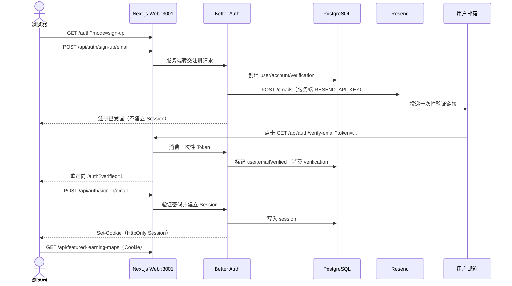
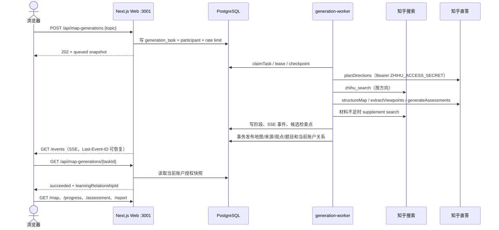

# 功能 API 对照图

本文把浏览器看到的功能一路映射到 Next.js Route Handler、同一进程内的应用服务、PostgreSQL/Worker 和外部供应方。它是排障与交接索引，不替代机器可读契约；请求/响应字段和错误以 [`api/openapi.yaml`](../../api/openapi.yaml) 及各功能 API 文档为准。

## 阅读边界

- **Web 公开端口**：`pnpm dev`、普通本地 Compose 和 Demo 默认为 `http://localhost:3000`；`pnpm real` 的宿主机入口为 `http://localhost:3001`（容器内 Next.js 仍监听 `3000`）。
- **数据库端口**：普通本地应用库为 `127.0.0.1:5432`；Demo 为 `127.0.0.1:55432`；真实 API 本地 Compose 为 `127.0.0.1:55433`。数据库只供服务端/Worker 使用，不是浏览器 API。
- **Worker 端口**：`generation-worker` 没有公开 HTTP 端口，通过 PostgreSQL 任务租约轮询；它与 Web 使用同一镜像但属于独立进程。
- **服务端密钥边界**：`BETTER_AUTH_SECRET`、`RESEND_API_KEY` 和 `ZHIHU_ACCESS_SECRET` 只在服务端运行时读取。浏览器绝不持有 Resend Key 或 Zhihu Access Secret；Web 进程也不读取知乎 Access Secret。
- **模式边界**：Demo 使用合成/固定数据、关闭注册和现场生成，不能证明真实 Resend 或知乎调用成功。真实 API 模式才允许注册邮件与 Worker 供应方调用，但当前仓库仍缺用户的真实凭据和在线成功证据。

## 功能地图

### 1. 认证与邮件

| 层                      | 实现与边界                                                                                                                                                                                                                                                                                                                                                                                                                                                                           |
| ----------------------- | ------------------------------------------------------------------------------------------------------------------------------------------------------------------------------------------------------------------------------------------------------------------------------------------------------------------------------------------------------------------------------------------------------------------------------------------------------------------------------------ |
| 前端页面/组件           | [`src/app/auth/page.tsx`](../../src/app/auth/page.tsx) 渲染登录、注册和验证状态；[`src/components/auth-form.tsx`](../../src/components/auth-form.tsx) 调用 Better Auth 邮箱端点；[`src/components/app-header.tsx`](../../src/components/app-header.tsx) 提供退出登录。真实模式注册后先显示“检查邮箱”，验证后仍须显式登录。                                                                                                                                                           |
| Route Handler / API     | [`src/app/api/auth/[...all]/route.ts`](../../src/app/api/auth/%5B...all%5D/route.ts) 只导出 `GET`/`POST` 并转交 Better Auth：`POST /api/auth/sign-up/email`、`POST /api/auth/sign-in/email`、`POST /api/auth/send-verification-email`、`GET /api/auth/verify-email`、`GET /api/auth/get-session`、`POST /api/auth/sign-out` 等托管端点。Demo 在进入 Better Auth 前拒绝注册和重发邮件；不允许的托管路径返回 `404`。                                                                   |
| 内部应用服务 / 公开端口 | [`IdentityService`](../../src/modules/identity/application/identity-service.ts) 通过公开的 [`IdentityAccess`](../../src/modules/identity/public/server.ts) 提供 `resolve`/`require`；[`createIdentityRuntime`](../../src/modules/identity/infrastructure/runtime.ts) 组装 Better Auth、Session Reader 和邮件发送器。Web 端口为普通/Demo `3000`，真实 API 宿主机 `3001`。                                                                                                             |
| PostgreSQL / Worker     | [`auth-schema.ts`](../../src/platform/database/auth-schema.ts) 的 `user`、`account`、`session`、`verification`、`rateLimit` 表；不经过 generation Worker。Session 由数据库保存，Cookie 只在浏览器传递。                                                                                                                                                                                                                                                                              |
| 外部 API                | Resend `POST https://api.resend.com/emails`，由 [`ResendVerificationEmailSender`](../../src/modules/identity/infrastructure/resend-verification-email-sender.ts) 直接调用。邮件投递失败映射为 `VERIFICATION_EMAIL_DELIVERY_FAILED`，不把供应方正文带回客户端。知乎 API 不参与认证。                                                                                                                                                                                                  |
| 认证/授权               | 注册、验证链接消费和登录是无 Session 或待验证状态；登录成功后 Better Auth 建立 HttpOnly、SameSite 会话 Cookie。除认证入口外，业务 Route Handler 均要求已验证的正式 Session；服务端身份来自 Cookie 对应的数据库 Session，不接受浏览器提交的 `userId`。                                                                                                                                                                                                                                |
| 主要源文件              | [`auth/page.tsx`](../../src/app/auth/page.tsx)、[`auth-form.tsx`](../../src/components/auth-form.tsx)、[`api/auth/[...all]/route.ts`](../../src/app/api/auth/%5B...all%5D/route.ts)、[`identity-auth.ts`](../../src/modules/identity/infrastructure/identity-auth.ts)、[`identity-service.ts`](../../src/modules/identity/application/identity-service.ts)、[`resend-verification-email-sender.ts`](../../src/modules/identity/infrastructure/resend-verification-email-sender.ts)。 |
| 详细 API 文档           | [认证框架契约](../api/authentication.md)（Better Auth 托管端点、邮件、Cookie、限流和 Demo 例外）。                                                                                                                                                                                                                                                                                                                                                                                   |

### 2. 精选地图

| 层                      | 实现与边界                                                                                                                                                                                                                                                                                                                                                                                                                                                                                                                                                            |
| ----------------------- | --------------------------------------------------------------------------------------------------------------------------------------------------------------------------------------------------------------------------------------------------------------------------------------------------------------------------------------------------------------------------------------------------------------------------------------------------------------------------------------------------------------------------------------------------------------------- |
| 前端页面/组件           | [`src/app/page.tsx`](../../src/app/page.tsx) 将已登录首页交给 [`HomePage`](../../src/components/home-page.tsx)；HomePage 读取精选目录、展示加入按钮并导航到学习关系；地图交互由 [`LearningWorkspace`](../../src/components/learning-workspace.tsx) 和 [`LearningMapCanvas`](../../src/components/learning-map-canvas.tsx) 承载。                                                                                                                                                                                                                                      |
| Route Handler / API     | `GET /api/featured-learning-maps`（目录）、`GET /api/featured-learning-maps/{mapId}`（当前精选版本详情）、`POST /api/featured-learning-maps/{mapId}/learning-relationship`（建立或恢复关系），分别位于 [`featured-learning-maps/route.ts`](../../src/app/api/featured-learning-maps/route.ts)、[`[mapId]/route.ts`](../../src/app/api/featured-learning-maps/%5BmapId%5D/route.ts)、[`learning-relationship/route.ts`](../../src/app/api/featured-learning-maps/%5BmapId%5D/learning-relationship/route.ts)。加入事务固定当前已发布版本和已发布题目集，不调用供应方。 |
| 内部应用服务 / 公开端口 | [`LearningCatalogService`](../../src/modules/learning-catalog/application/learning-catalog.ts) 经 [`LearningCatalogAccess`](../../src/modules/learning-catalog/public/server.ts) 暴露目录、详情及关系建立能力；[`DrizzleLearningCatalogRepository`](../../src/modules/learning-catalog/infrastructure/drizzle-learning-catalog.ts) 负责持久化。Web 普通/Demo `3000`，真实 API `3001`。                                                                                                                                                                                |
| PostgreSQL / Worker     | [`catalog-schema.ts`](../../src/platform/database/catalog-schema.ts) 的 `learning_map`、`learning_map_version`、`learning_map_node`、`learning_map_prerequisite`、`knowledge_source`、`learning_map_node_source`、`learning_viewpoint`、`learning_viewpoint_source`、`featured_learning_map` 和 `learning_relationship` 表；精选读取不经过 Worker。                                                                                                                                                                                                                   |
| 外部 API                | 无。精选内容来自已发布的不可变地图版本和精选指针；读取路径不依赖 Resend、知乎或模型在线可用。                                                                                                                                                                                                                                                                                                                                                                                                                                                                         |
| 认证/授权               | 三个接口均要求当前账户的已验证 Better Auth Session。服务端只按 Session 用户建立关系；不接受 `userId`、`versionId` 或 `questionSetId`。地图详情只返回当前精选指针指向的发布版本。                                                                                                                                                                                                                                                                                                                                                                                      |
| 主要源文件              | [`home-page.tsx`](../../src/components/home-page.tsx)、[`learning-workspace.tsx`](../../src/components/learning-workspace.tsx)、[`learning-map-canvas.tsx`](../../src/components/learning-map-canvas.tsx)、[`featured-learning-maps/route.ts`](../../src/app/api/featured-learning-maps/route.ts)、[`learning-catalog.ts`](../../src/modules/learning-catalog/application/learning-catalog.ts)、[`drizzle-learning-catalog.ts`](../../src/modules/learning-catalog/infrastructure/drizzle-learning-catalog.ts)。                                                      |
| 详细 API 文档           | [精选学习地图前端接入契约](../api/featured-learning-maps.md)。                                                                                                                                                                                                                                                                                                                                                                                                                                                                                                        |

### 3. 学习关系

| 层                      | 实现与边界                                                                                                                                                                                                                                                                                                                                                                                                                                                                                                                          |
| ----------------------- | ----------------------------------------------------------------------------------------------------------------------------------------------------------------------------------------------------------------------------------------------------------------------------------------------------------------------------------------------------------------------------------------------------------------------------------------------------------------------------------------------------------------------------------- |
| 前端页面/组件           | 首页 [`HomePage`](../../src/components/home-page.tsx) 读取“我的学习”关系摘要；[`src/app/learn/[learningRelationshipId]/page.tsx`](../../src/app/learn/%5BlearningRelationshipId%5D/page.tsx) 将关系 ID 交给 [`LearningWorkspace`](../../src/components/learning-workspace.tsx)；工作区按关系恢复固定地图版本和进度。                                                                                                                                                                                                                |
| Route Handler / API     | `GET /api/learning-relationships` 位于 [`learning-relationships/route.ts`](../../src/app/api/learning-relationships/route.ts)，返回当前账户可恢复的关系摘要；`GET /api/learning-relationships/{learningRelationshipId}/map` 位于 [`map/route.ts`](../../src/app/api/learning-relationships/%5BlearningRelationshipId%5D/map/route.ts)，读取关系绑定的不可变地图版本。建立关系的写入口属于上面的精选加入接口或生成发布流程，不由本读取 API 凭 `mapId` 创建。                                                                         |
| 内部应用服务 / 公开端口 | 仍由 [`LearningCatalogService`](../../src/modules/learning-catalog/application/learning-catalog.ts) / [`LearningCatalogAccess`](../../src/modules/learning-catalog/public/server.ts) 提供 `listLearningRelationships` 和 `findByLearningRelationship`；Web 普通/Demo `3000`，真实 API `3001`。                                                                                                                                                                                                                                      |
| PostgreSQL / Worker     | `learning_relationship` 与地图目录表共同保证 `(userId, versionId)` 关系唯一并固定版本；读取不经过 Worker，生成 Worker 只在生成成功发布时新增关系。                                                                                                                                                                                                                                                                                                                                                                                  |
| 外部 API                | 无。关系恢复读取已持久化事实，不实时请求知乎或模型。                                                                                                                                                                                                                                                                                                                                                                                                                                                                                |
| 认证/授权               | 需要已验证正式 Session；`learningRelationshipId` 必须属于当前账户，其他账户、不存在或不可读版本统一为 `404 resource_not_found`，不泄露关系存在性。客户端不提交用户 ID。                                                                                                                                                                                                                                                                                                                                                             |
| 主要源文件              | [`learn/[learningRelationshipId]/page.tsx`](../../src/app/learn/%5BlearningRelationshipId%5D/page.tsx)、[`home-page.tsx`](../../src/components/home-page.tsx)、[`learning-workspace.tsx`](../../src/components/learning-workspace.tsx)、[`learning-relationships/route.ts`](../../src/app/api/learning-relationships/route.ts)、[`map/route.ts`](../../src/app/api/learning-relationships/%5BlearningRelationshipId%5D/map/route.ts)、[`learning-catalog.ts`](../../src/modules/learning-catalog/application/learning-catalog.ts)。 |
| 详细 API 文档           | [学习关系列表与地图读取契约](../api/learning-relationships.md)。                                                                                                                                                                                                                                                                                                                                                                                                                                                                    |

### 4. 节点答题 / 进度

| 层                      | 实现与边界                                                                                                                                                                                                                                                                                                                                                                                                                                                                                                                                                                                                  |
| ----------------------- | ----------------------------------------------------------------------------------------------------------------------------------------------------------------------------------------------------------------------------------------------------------------------------------------------------------------------------------------------------------------------------------------------------------------------------------------------------------------------------------------------------------------------------------------------------------------------------------------------------------- |
| 前端页面/组件           | [`LearningWorkspace`](../../src/components/learning-workspace.tsx) 并行读取地图与进度、在提交后刷新进度；[`AssessmentPanel`](../../src/components/assessment-panel.tsx) 获取安全题面并提交四种题型答案；[`LearningMapCanvas`](../../src/components/learning-map-canvas.tsx) 展示节点状态。页面入口为 [`src/app/learn/[learningRelationshipId]/page.tsx`](../../src/app/learn/%5BlearningRelationshipId%5D/page.tsx)。                                                                                                                                                                                       |
| Route Handler / API     | `GET`/`POST /api/learning-relationships/{learningRelationshipId}/nodes/{nodeId}/assessment` 位于 [`assessment/route.ts`](../../src/app/api/learning-relationships/%5BlearningRelationshipId%5D/nodes/%5BnodeId%5D/assessment/route.ts)；`GET /api/learning-relationships/{learningRelationshipId}/progress` 位于 [`progress/route.ts`](../../src/app/api/learning-relationships/%5BlearningRelationshipId%5D/progress/route.ts)。提交必须带 `Idempotency-Key`；服务端不向题面返回答案。                                                                                                                     |
| 内部应用服务 / 公开端口 | [`LearningAssessmentService`](../../src/modules/learning-assessment/application/learning-assessment.ts) 经 [`LearningAssessmentAccess`](../../src/modules/learning-assessment/public/server.ts) 读取题面、判题并原子写尝试/节点最佳成绩；[`LearningProgressService`](../../src/modules/learning-progress/application/learning-progress.ts) 经 [`LearningProgressAccess`](../../src/modules/learning-progress/public/server.ts) 投影关系进度。Web 普通/Demo `3000`，真实 API `3001`。                                                                                                                        |
| PostgreSQL / Worker     | 题目、选项、标准答案、题目来源和不可变尝试在 [`assessment-schema.ts`](../../src/platform/database/assessment-schema.ts) 的 assessment 表；节点最佳成绩与完成事实在 [`learning_progress_node`](../../src/platform/database/progress-schema.ts)。判题事务由 Web 应用完成，不经过生成 Worker。                                                                                                                                                                                                                                                                                                                 |
| 外部 API                | 无。答题和进度读取只使用已发布题目集、关系固定版本和服务端答案；不调用知乎/Resend。                                                                                                                                                                                                                                                                                                                                                                                                                                                                                                                         |
| 认证/授权               | 需要当前账户已验证 Session；服务端先验证关系归属、固定地图版本和题目集，再判题。答案、正确选项、评分细节和用户 ID 不由浏览器声明。达到 `8000` 基点才由服务端标记节点完成，完成状态不能回退。                                                                                                                                                                                                                                                                                                                                                                                                                |
| 主要源文件              | [`assessment-panel.tsx`](../../src/components/assessment-panel.tsx)、[`learning-workspace.tsx`](../../src/components/learning-workspace.tsx)、[`assessment/route.ts`](../../src/app/api/learning-relationships/%5BlearningRelationshipId%5D/nodes/%5BnodeId%5D/assessment/route.ts)、[`progress/route.ts`](../../src/app/api/learning-relationships/%5BlearningRelationshipId%5D/progress/route.ts)、[`learning-assessment.ts`](../../src/modules/learning-assessment/application/learning-assessment.ts)、[`learning-progress.ts`](../../src/modules/learning-progress/application/learning-progress.ts)。 |
| 详细 API 文档           | [学习验证与进度 API](../api/learning-assessment.md)。                                                                                                                                                                                                                                                                                                                                                                                                                                                                                                                                                       |

### 5. 私人报告

| 层                      | 实现与边界                                                                                                                                                                                                                                                                                                                                                                                                                                                                                     |
| ----------------------- | ---------------------------------------------------------------------------------------------------------------------------------------------------------------------------------------------------------------------------------------------------------------------------------------------------------------------------------------------------------------------------------------------------------------------------------------------------------------------------------------------- |
| 前端页面/组件           | [`src/app/learn/[learningRelationshipId]/report/page.tsx`](../../src/app/learn/%5BlearningRelationshipId%5D/report/page.tsx) 负责登录门禁并渲染 [`LearningReportPage`](../../src/components/learning-report-page.tsx)；报告链接回工作区节点和来源。                                                                                                                                                                                                                                            |
| Route Handler / API     | `GET /api/learning-relationships/{learningRelationshipId}/report`，位于 [`report/route.ts`](../../src/app/api/learning-relationships/%5BlearningRelationshipId%5D/report/route.ts)。接口每次按关系绑定版本、题目集、进度和尝试摘要投影，不创建分享快照。                                                                                                                                                                                                                                       |
| 内部应用服务 / 公开端口 | [`LearningReportService`](../../src/modules/learning-report/application/learning-report.ts) 经 [`LearningReportAccess`](../../src/modules/learning-report/public/server.ts) 组合目录与进度公开契约并生成私人投影；Web 普通/Demo `3000`，真实 API `3001`。                                                                                                                                                                                                                                      |
| PostgreSQL / Worker     | 读取 catalog、assessment 和 `learning_progress_node` 形成同一关系的报告事实；没有独立报告表，也不经过 Worker。报告不重复保存答案或 Session。                                                                                                                                                                                                                                                                                                                                                   |
| 外部 API                | 无。报告读取不请求实时供应方，来源链接是发布时保存的知乎 URL 元数据。                                                                                                                                                                                                                                                                                                                                                                                                                          |
| 认证/授权               | 需要已验证正式 Session，且关系必须属于当前账户；错误账户与不存在关系统一 `404 resource_not_found`。一期没有分享令牌、跨账户读取、接收者授权或撤销入口。                                                                                                                                                                                                                                                                                                                                        |
| 主要源文件              | [`learn/[learningRelationshipId]/report/page.tsx`](../../src/app/learn/%5BlearningRelationshipId%5D/report/page.tsx)、[`learning-report-page.tsx`](../../src/components/learning-report-page.tsx)、[`report/route.ts`](../../src/app/api/learning-relationships/%5BlearningRelationshipId%5D/report/route.ts)、[`learning-report.ts`](../../src/modules/learning-report/application/learning-report.ts)、[`learning-report.ts`](../../src/modules/learning-report/domain/learning-report.ts)。 |
| 详细 API 文档           | [私人结课报告 API](../api/learning-report.md)。                                                                                                                                                                                                                                                                                                                                                                                                                                                |

### 6. 现场生成

| 层                      | 实现与边界                                                                                                                                                                                                                                                                                                                                                                                                                                                                                                                                                                                                                                                                                                                                                |
| ----------------------- | --------------------------------------------------------------------------------------------------------------------------------------------------------------------------------------------------------------------------------------------------------------------------------------------------------------------------------------------------------------------------------------------------------------------------------------------------------------------------------------------------------------------------------------------------------------------------------------------------------------------------------------------------------------------------------------------------------------------------------------------------------- |
| 前端页面/组件           | [`src/app/generate/page.tsx`](../../src/app/generate/page.tsx) 负责 Session 门禁并渲染 [`GenerationPage`](../../src/components/generation-page.tsx)；首页 [`HomePage`](../../src/components/home-page.tsx) 是入口。GenerationPage `POST` 创建任务，订阅 SSE 并以 `Last-Event-ID` 重连，收到终态后读取授权快照并进入 `/learn/{learningRelationshipId}`。                                                                                                                                                                                                                                                                                                                                                                                                   |
| Route Handler / API     | `POST /api/map-generations`（创建/复用任务）在 [`map-generations/route.ts`](../../src/app/api/map-generations/route.ts)；`GET /api/map-generations/{taskId}`（授权快照）在 [`[taskId]/route.ts`](../../src/app/api/map-generations/%5BtaskId%5D/route.ts)；`GET /api/map-generations/{taskId}/events`（可恢复 SSE）在 [`events/route.ts`](../../src/app/api/map-generations/%5BtaskId%5D/events/route.ts)。创建返回 `202`；事件只暴露安全阶段、序号和终态类别，结果标识从快照读取。Demo 在身份校验后返回 `503 generation_unavailable`，不创建任务。                                                                                                                                                                                                       |
| 内部应用服务 / 公开端口 | Web 侧公开 [`GenerationAccess`](../../src/modules/map-generation/public/server.ts)，由 [`DrizzleGenerationTaskStore`](../../src/modules/map-generation/infrastructure/drizzle-generation-task-store.ts) 提供任务、参与者、快照和事件读写；独立 Worker 侧运行 [`MapGenerationWorker`](../../src/modules/map-generation/application/generation-worker.ts)，执行租约、阶段恢复、重试和发布。普通/Demo Web `3000`，真实 API 宿主机 `3001`；Worker 无 HTTP 端口。                                                                                                                                                                                                                                                                                              |
| PostgreSQL / Worker     | [`generation-schema.ts`](../../src/platform/database/generation-schema.ts) 的 `generation_task`、`generation_participant`、`generation_checkpoint`、`generation_event`、`generation_cache`、`generation_rate_limit` 表保存状态、参与关系、检查点、SSE 序号、缓存和限流；发布器在事务中写 catalog/assessment 表和当前账户学习关系。Worker 入口为 [`src/workers/generation-worker.ts`](../../src/workers/generation-worker.ts)，命令是 `pnpm worker:generation`。                                                                                                                                                                                                                                                                                           |
| 外部 API                | Worker 唯一调用外部供应方：知乎搜索 `GET https://developer.zhihu.com/api/v1/content/zhihu_search`，知乎直答 `POST https://developer.zhihu.com/v1/chat/completions`（冻结模型 `zhida-thinking-1p5`）。适配器是 [`ZhihuSourceSearch`](../../src/modules/external-providers/infrastructure/zhihu-source-search.ts) 和 [`ZhihuStructuredModel`](../../src/modules/external-providers/infrastructure/zhida-structured-model.ts)；Web 与浏览器不读取 `ZHIHU_ACCESS_SECRET`。                                                                                                                                                                                                                                                                                    |
| 认证/授权               | 创建、快照和每次 SSE 重连都要求已验证正式 Session；服务端建立/检查 `generation_participant`，非参与者统一 `404`。任务成功后只为当前账户返回其 `learningRelationshipId`。供应方密钥仅注入 Worker，候选内容、第三方正文和密钥不进入 HTTP/SSE。                                                                                                                                                                                                                                                                                                                                                                                                                                                                                                              |
| 主要源文件              | [`generation-page.tsx`](../../src/components/generation-page.tsx)、[`generate/page.tsx`](../../src/app/generate/page.tsx)、[`map-generations/route.ts`](../../src/app/api/map-generations/route.ts)、[`[taskId]/route.ts`](../../src/app/api/map-generations/%5BtaskId%5D/route.ts)、[`events/route.ts`](../../src/app/api/map-generations/%5BtaskId%5D/events/route.ts)、[`runtime.ts`](../../src/modules/map-generation/infrastructure/runtime.ts)、[`drizzle-generation-task-store.ts`](../../src/modules/map-generation/infrastructure/drizzle-generation-task-store.ts)、[`generation-worker.ts`](../../src/modules/map-generation/application/generation-worker.ts)、[`src/workers/generation-worker.ts`](../../src/workers/generation-worker.ts)。 |
| 详细 API 文档           | [自定义学习地图生成接口](../api/map-generation.md)；外部调用细节见[知乎开放平台外部适配契约](../api/zhihu-open-platform.md)。                                                                                                                                                                                                                                                                                                                                                                                                                                                                                                                                                                                                                             |

### 7. 运行健康

| 层                      | 实现与边界                                                                                                                                                                                                                                                                                                                                         |
| ----------------------- | -------------------------------------------------------------------------------------------------------------------------------------------------------------------------------------------------------------------------------------------------------------------------------------------------------------------------------------------------- |
| 前端页面/组件           | 没有专用的产品 health 页面或健康组件；[`src/app/page.tsx`](../../src/app/page.tsx) 的 `/` 可作为 Web 可达性 smoke（无 Cookie 时会重定向到 `/auth`，不能当作已登录业务验收），业务界面仍由 [`HomePage`](../../src/components/home-page.tsx) 渲染。                                                                                                  |
| Route Handler / API     | 没有独立的 `/health` Route Handler。Compose Web healthcheck 执行 [`scripts/healthcheck.mjs`](../../scripts/healthcheck.mjs)：在容器内连接 `DATABASE_URL`、执行 `select 1`，再请求 `http://127.0.0.1:3000/`；生产健康门禁还请求一个需要 Session 的业务端点并只接受非 `5xx`。不要新增匿名业务数据接口来替代这些检查。                                |
| 内部应用服务 / 公开端口 | 健康检查不是应用服务；它检查 Next.js Web 容器内 `3000`，真实 API 宿主机映射为 `3001`。生产运维只对外开放 Nginx 的 `80/443`，Web loopback `3000` 不应直接暴露公网。                                                                                                                                                                                 |
| PostgreSQL / Worker     | PostgreSQL Compose healthcheck 使用 `pg_isready`；[`ops/production-healthcheck.sh`](../../ops/production-healthcheck.sh) 检查 PostgreSQL、迁移容器、Web/Worker 容器和 `generation_task` 租约；[`ops/worker-lease-health.sh`](../../ops/worker-lease-health.sh) 检查活动租约、过期租约和落后心跳。Worker 无公开端口，进程存活不等于有任务租约健康。 |
| 外部 API                | 无。健康探针不调用 Resend 或知乎，不消耗供应方额度，也不发送邮件；真实供应方连通性只能由真实的 `pnpm real:verify:zhihu` 或完整生成链路验证。                                                                                                                                                                                                       |
| 认证/授权               | 容器级 Web healthcheck 不携带用户 Cookie，只证明进程和数据库可达；生产业务端点探针也不打印或保存 Cookie。健康绿灯不证明账户、邮件、精选内容或供应方成功。                                                                                                                                                                                          |
| 主要源文件              | [`scripts/healthcheck.mjs`](../../scripts/healthcheck.mjs)、[`ops/production-healthcheck.sh`](../../ops/production-healthcheck.sh)、[`ops/worker-lease-health.sh`](../../ops/worker-lease-health.sh)、[`compose.real.yaml`](../../compose.real.yaml)、[`compose.production.yaml`](../../compose.production.yaml)。                                 |
| 详细 API 文档           | 健康检查没有业务 API 契约；运维边界见[生成 Worker 部署](generation-worker-deployment.md)与[生产发布与恢复运维](production-operations.md)，HTTP/SSE 语义见[API 约定](../api/conventions.md)。                                                                                                                                                       |

## 端到端时序

### 真实注册邮件闭环

- `RESEND_API_KEY` 从不出现在浏览器、页面 props、HTTP 响应、日志或 SSE。注册成功只表示账户请求已受理；邮件供应方失败不会被前端解释为“已送达”，可按认证契约显式重发。
- Demo 不走这条真实闭环：注册和重发在 UI 与 Route Handler 都被关闭，固定账号由准备脚本使用本地验证链接建立。

### 真实知乎生成闭环

- `ZHIHU_ACCESS_SECRET` 只注入 `generation-worker`；浏览器和 Web 容器均不持有它。Web 只读写任务状态并提供授权后的快照/SSE。
- 生成阶段可能进行多次知乎搜索和多次知乎直答；每次在线调用会消耗供应方对应额度。命中有效缓存、加入活动任务或 Demo 的禁用响应不等价于新的真实供应方成功。
- 真实注册、邮件送达、知乎探针和完整生成在缺少用户凭据时均不能宣称已验收；请按[真实 API 本地运行](local-setup.md#真实-api-本地运行)执行受控验证。
